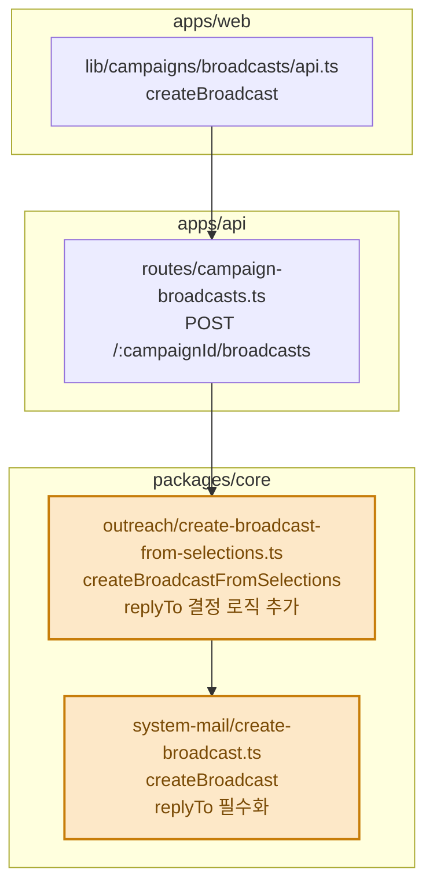

# 작업 제안서

코드 작업 전에 팀 리뷰를 받기 위한 제안서를 작성한다. 제안서가 승인되면 그때 코드 작업을 시작한다.

## 작성 전 준비

- 제안서에 들어갈 함수·테이블·화면은 반드시 실제 코드를 읽고 확인한 것만 쓴다. 추측한 콜스택·스키마 금지.
- 사용자와 논의로 이미 확정된 결정(스코프, 기본값 규칙 등)은 제안서에 반영하고, 미확정 사항은 "열린 질문" 섹션으로 남기지 말고 작성 전에 사용자에게 물어 확정한다.

## 산출물

마크다운 문서 하나. 파일 위치는 사용자가 지정하지 않으면 `work-proposals/<YYYYMMDD>/<HHMM>-<작성자>-<kebab-case-제목>.md`. 날짜·시각은 작성 시점, 작성자는 git user name이다 (예: `work-proposals/20260901/1742-qodot-system-mail-reply-to-default.md`).

## 포맷

아래 섹션 순서와 규칙을 그대로 따른다.

### 1. 해결하고 싶은 문제

- 추상적인 말 금지. "고도화", "버그 수정", "개선" 같은 표현은 절대 쓰지 않는다.
- 고객(사용자)의 목표와 실제 문제 상황을 드러낸다. 누가, 어떤 상황에서, 무엇이 안 되거나 불편한지 구체적으로 쓴다.
- 코드 언급 금지. 파일 경로, 함수명, 컬럼명 등 구현 세부는 콜스택 섹션에만 쓴다.
- 좋은 예: "담당자가 캠페인 진행 상황을 확인하려면 스프레드시트를 직접 열어 최신 데이터로 갱신해야 한다." / 나쁜 예: "리포트 기능 고도화"

### 2. 해결책

- 어떤 방식으로 문제를 해결하는지 최대한 간결하게. **1문장 권장, 최대 2문장.**
- 코드 언급 금지. 파일 경로, 함수명, 컬럼명 등 구현 세부는 콜스택 섹션에만 쓴다.
- 비교한 다른 해결책이 있으면 각각 한 줄로 "대안 — 탈락 이유"를 적는다. 없으면 이 하위 항목은 생략.
- 대안은 사용자와 실제로 검토·논의한 것만 적는다. 그럴듯한 대안을 지어내지 않는다.

### 3. 와이어 프레임

- 화면 변경이 없으면 섹션 전체 생략.
- 수정하는 메뉴가 어디이고 어떻게 바뀌는지 와이어 프레임 이미지를 첨부한다.
- 새로 만드는 메뉴라면 진입점(어느 화면의 어느 요소에서 들어가는지)까지 포함한다.
- 이미지는 제안서 파일 옆 `assets/` 디렉터리에 두고 상대 경로로 첨부한다.

### 4. 콜스택

- 함수의 콜스택 체인으로 다이어그램을 작성한다. 노드 라벨은 세 줄 형식을 따른다: 1줄 파일 경로, 2줄 함수 이름, 3줄 변경 요지 1줄(변경 없는 노드는 생략).
- 다이어그램에 영역을 표시해 web / api / core / db 등 주요 패키지를 구분한다. mermaid `flowchart`의 `subgraph`를 패키지 경계로 쓴다.
- 변경이 일어나는 노드는 `classDef changed`로 하이라이트하고, 노드 라벨에 변경 요지를 한 줄 병기한다. 수정 없는 노드는 하이라이트하지 않는다.
- 다이어그램은 변경 지점을 지나는 체인만 담는다. 변경과 무관한 별도 경로·노드는 넣지 않는다.
- 변경이라고 적기 전에 실제로 코드가 바뀌는지 확인한다. 기존 분기·폴백으로 이미 처리되는 동작은 변경으로 적지 않는다.
- 라벨 줄바꿈에 `<br/>`를 쓰지 않는다(렌더러가 무시함). 예시처럼 따옴표+백틱 마크다운 문자열 안에 실제 줄바꿈을 쓴다.

예:



- 새로 만드는 함수는 시그니처(이름, 입력·출력 타입)를 함께 적는다.
- 시그니처 diff 앞 설명은 함수 이름 + 변경 요지 1줄로만 쓴다. 파일 경로나 결정 로직 나열을 붙이지 않는다.
- 시그니처가 여러 개면 콜스택에서 먼저 불리는 함수를 위에 적는다.
- 기존 함수의 시그니처가 바뀌면 전체 시그니처를 펼친 diff 코드블록으로 보여준다. 입력 객체 타입과 반환 타입(`Promise<Result<성공, 에러>>`)까지 전부 펼쳐 쓰고, 바뀌는 줄만 `-`/`+`로 표시한다. "before/after" 요약 주석이나 `...` 생략으로 대신하지 않는다.

예:

```diff
 createBroadcast(input: {
   templateSubject: string
-  replyTo?: string
+  replyTo: string
 }): Promise<Result<SystemMailBroadcast, {
   code: 'empty_deliveries' | 'insert_failed'
   message: string
 }>>
```

### 5. 테이블 설계

- 테이블 추가·변경이 없으면 섹션 전체 생략. "변경 없음"이라고 적은 섹션을 만들지 않는다 — 생략 대상 섹션은 제목조차 쓰지 않는다 (와이어 프레임도 동일).
- 테이블별로 컬럼명, 타입, null 허용, 기본값, 제약(FK·unique)을 묘사한다. 기존 테이블 변경이면 바뀌는 컬럼만 적고 마이그레이션 필요 여부를 명시한다.

## 작성 후

- 제안서를 사용자에게 보여주고 리뷰를 기다린다. 승인 전에 코드 작업을 시작하지 않는다.
- 제안서를 커밋하는 브랜치는 `work-proposals/<kebab-case-제목>`으로 만든다.
